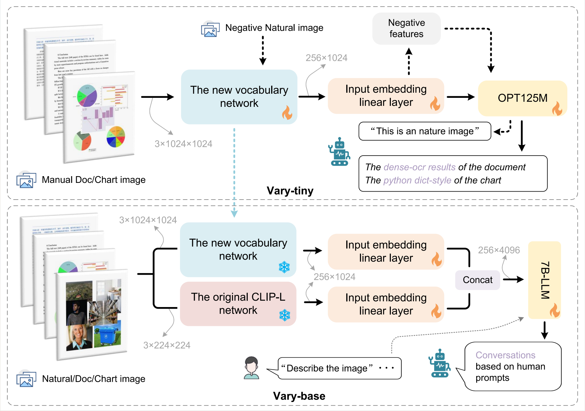

#  Vary

<h3><a href="">Vary: Scaling up the Vision Vocabulary for Large Vision-Language Models</a></h3>

[Haoran Wei](https://scholar.google.com/citations?user=J4naK0MAAAAJ&hl=en), [Lingyu Kong](), [Jinyue Chen](), [Liang Zhao](), [Zheng Ge](https://joker316701882.github.io/), [Jinrong Yang](https://yancie-yjr.github.io/), [Jianjian Sun](https://scholar.google.com/citations?user=MVZrGkYAAAAJ&hl=en), [Chunrui Han](), [Xiangyu Zhang](https://scholar.google.com/citations?user=yuB-cfoAAAAJ&hl=en)
	
<a href="https://varybase.github.io/"></a>
<a href="#"></a> 

Vary is an efficient and effective method to scale up the Vision vocabulary of LVLMs. 
                    The procedures of Vary is naturally divided into two-folds: the generation and integration of a new vision 
                    vocabulary. In the first phase, we devise a "vocabulary network" along with a tiny decoder-only 
                    transformer to produce the desired vocabulary via autoregression. In the next, we scale up the vanilla 
                    vision vocabulary by merging the new one with the original one (CLIP), enabling the LVLMs can quickly 
                    garner new features. 



Code, model weights, and demo will be released soon.


## Contact
If you have any questions related to the code or the paper, feel free to email Haoran Wei (`xxx.xxx@xxx.com`).

## Citation
If you find our work useful in your research, please consider citing Vary:
```tex
@article{dong2023dreamllm,
  author = {Haoran, Wei and Lingyu, Kong and Jinyue, Chen and Liang, Zhao and Zheng, Ge and Jinrong, Yang and Jianjian, Sun and Chunrui, Han and Xiangyu, Zhang},
  title = {Vary: Scaling up the Vision Vocabulary for Large Vision-Language Models},
  journal = {arXiv preprint arXiv:2309.11499},
  year = {2023},
}
```
